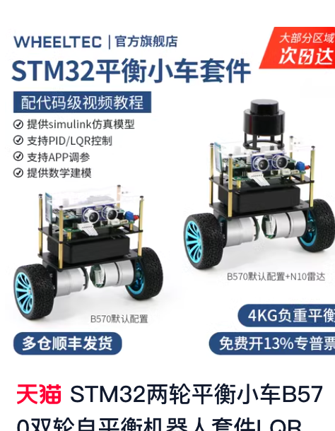
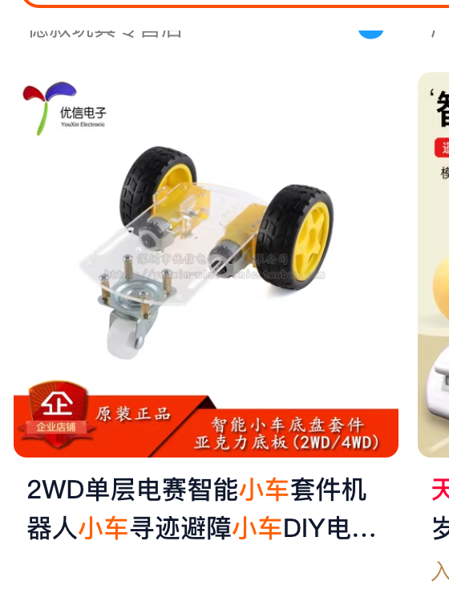
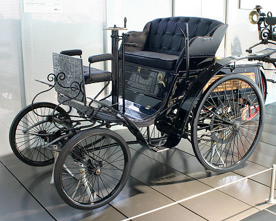
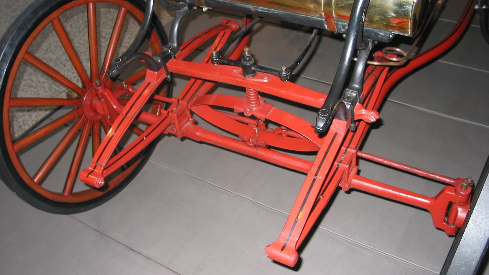

# 从0到0.1 方向

我们总是知道车子是什么：一块板子4个轮
so，当我们开始准备自己DIY一个车子的时候，是否也应该从这里开始呢。
让我们搜索一下taobao上都有些什么小车，借鉴一下成熟方案，

不过在这之前，确认一下我们的小车定位：
- 模型玩具
- 不载人
- ~~暂时~~不需要智能辅助，可能需要摄像头、GPS、陀螺仪来让小车更有趣一点
- 需要以某种形式遥控 wifi？bt？
- 仅可能的贴近现代新能源汽车的实现

## 淘宝
我搜索了一下,小车算是一个比较成熟的分类了

有这样的

也有这样的


价格不贵，而且实现蛮丰富的。

感觉这个项目可以结束的节奏。。。没意义啊

## 现代新能源汽车
虽然淘宝搜完已经感觉没继续搞的必要，姑且还是看看玩具和真家伙之间的区别吧。。。
作为一名资深米粉，理所当然的参考小米su7的维修手册
~~我能说是找不到其他品牌有这么统一规范的材料嘛~~

非常丰富的内容，对齐我们的目标和定位，做一下裁剪：

- 动力
    - 充电
    - 电驱
    - 电池
- 底盘
    - 转向
    - 悬架
    - 车轮
    - 制动
    - 传动
    - 悬置
- 热管理
    - 冷却
- 车身
    - 车身结构
    - 下车身结构
- 信息&控制
    - 驾驶信息
    - 音响
    - 天线
    - 信息娱乐系统
- 电器功能
    - 轮速
    - 中央域控制器
- 智能驾驶&智能座舱
    - 视觉系统
    - 定位系统

funny～我们可以简单的就明白，如何按照现代新能源汽车的架构来自己DIY小车

## 更久之前
so，虽然我们可以通过公开的信息，对于如何DIY小车有个大概的认识，
但是认有一个大问题：
现在的车已经过于复杂，抛开直觉不谈，我们应该从哪里开始？

我把视线继续转向互联网，尝试找到他最初的形态：

```
奔驰 Velo 是最早的汽车之一，由卡尔·奔驰于 1894 年推出，作为 Patent-Motorwagen 的后续产品。1894 年制造了 67 辆奔驰 Velos，1895 年制造了 134 辆。早期的 Velo 有一个 1L 1.5 公制马力（1.5 hp;1.1 kW）发动机，后来有一个 3 公制马力（3 hp;2 kW）发动机，最高时速为 19 公里/小时（12 英里/小时）。Velo 由 Karl Benz 正式推出，名为 Velocipede，成为世界上第一辆标准化的量产车。
Velocipede 在 1894 年至 1902 年间仍在生产，最终生产了 1,200 多辆。

```



甚至可以在[丰田汽车博物馆](https://toyota-automobile-museum.jp/en/archives/car-database/detail.html?id=340)中，找到它多个角度的清晰照片.



从图片中我们可以分析以下内容
1. 下车身有管状结构构成基础的底盘
2. 底盘没有悬挂或缓冲机构
2. 前后轮车轴是单根结构，没有现在半轴架构
3. 有拉杆结构的转向机构
2. 中置引擎通过皮带、链条结构传递转动到后轮
2. 没有发现明显的制动系统，搜索之后其使用的鼓刹制动,不过暂时没有刹车也不重要

这样的标准来实现一个小车就比较容易的感觉了。

