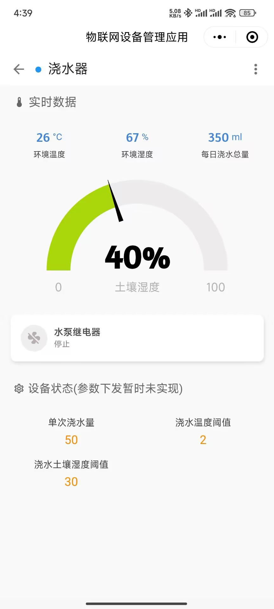

# 植物浇水机

这是一个阶段性的产品，姑且说是一个产品吧。

综合了dht11+esp32c3+电容式土壤湿度传感器+继电器水泵等几个简单周边设备，并且准备在真实世界中实际运行的产品。

## route
设备上大致的思路是：
1. 循环的读取dht11温湿度，土壤的湿度，并通过mqtt上报到ThingsCloud
2. 当土壤湿度小于设定阈值，且室温不极端的情况下，让水泵运行浇水
3. 继续循环
先用面包版调试，然后洞洞板手搓。

云端的大致思路：
1. 接收设备上传的数据
2. 云端逻辑，如每日浇水量统计
3. 通过ThingsCloud 微信小程序提供状态检测

小程序页面：

## 已知问题&todo
1. wifi连接不稳定时，不会重连，或者重连有些问题
2. 配置参数不支持云端下发，因为订阅部分还没做，这个会做
3. 因为参数不支持云端下发，也就没有本地固化逻辑，这个会做
3. 目前都是同步逻辑实现，也没有中断逻辑，会不会改不好说
4. 没有wifi初始化配置逻辑，只能在固件里写死
5. ota还没做，因为订阅也没做，ota就没法做了
6. 还有一堆核心功能之外的feature，比如日最大浇水量限制，水池水量不足报警之类的，有些可能会搞，有些估计不会
7. 现在用的乐鑫的devkit单价太高，可能会换成esp32c3 supermini，不过最近双11，涨价有点多。。。晚点再看看

## 总结
总的来说目前跨出了一步

## 版本记录
- v1.0.0 小程序，硬件基本能跑通主流程，会用洞洞板搓第一版的硬件